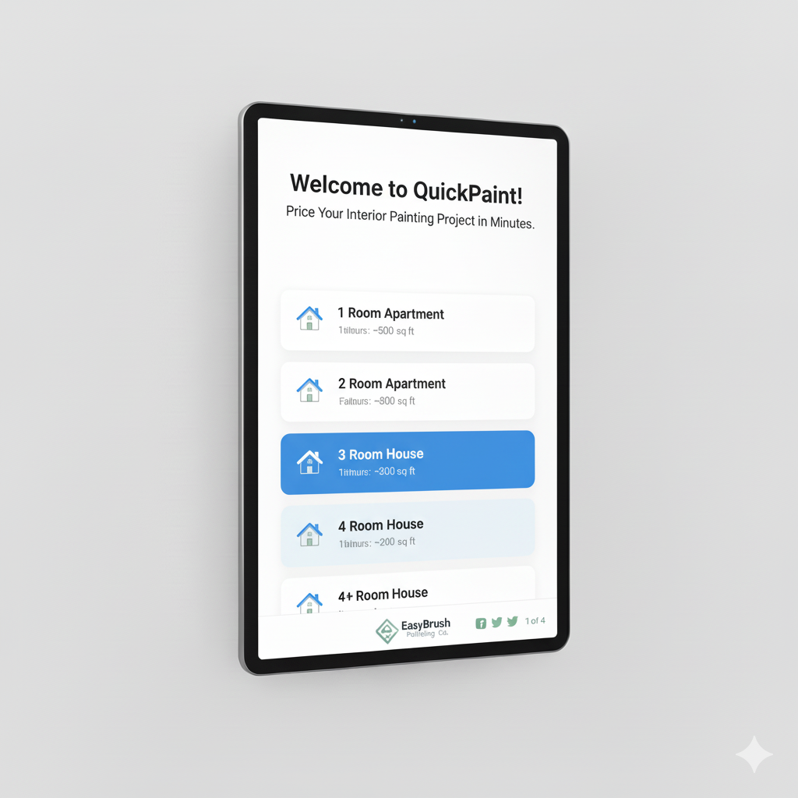
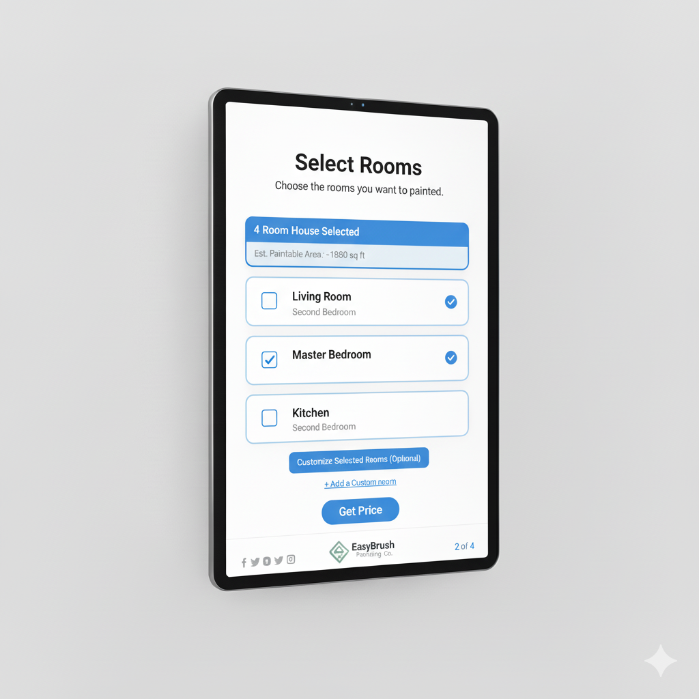
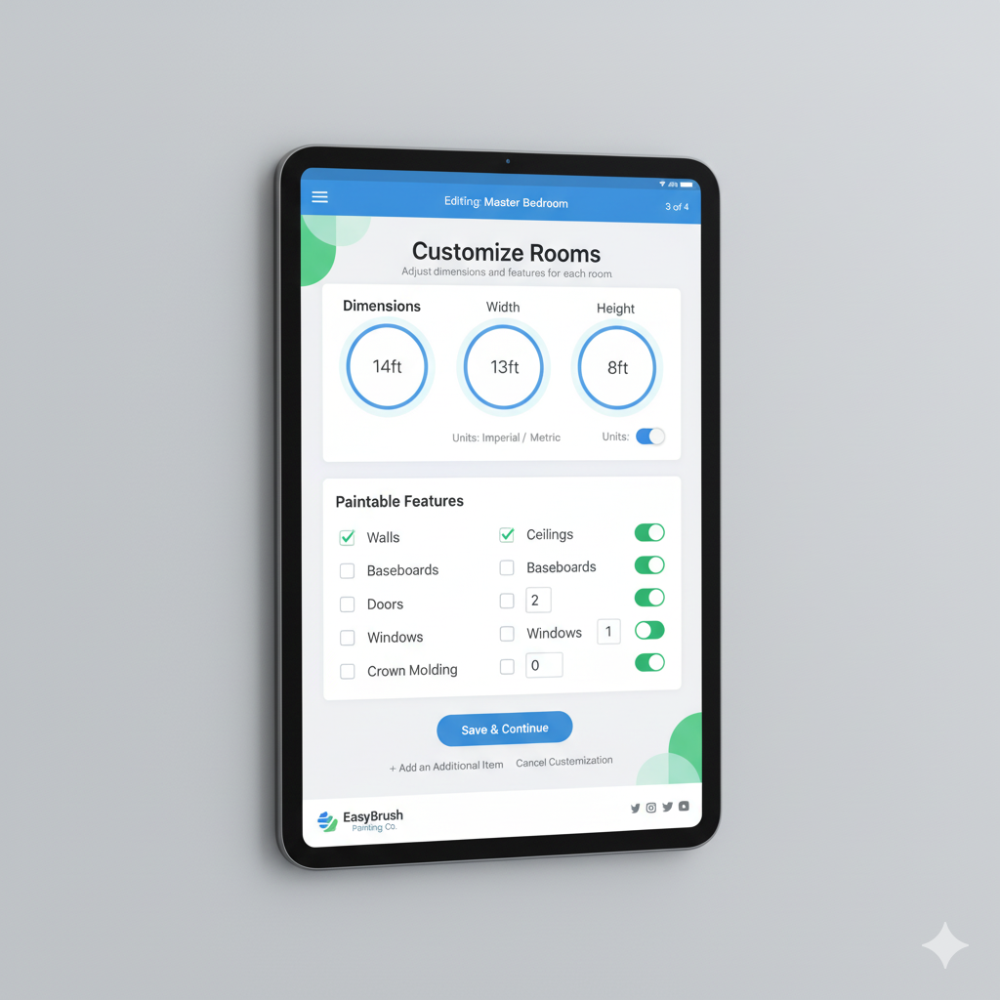
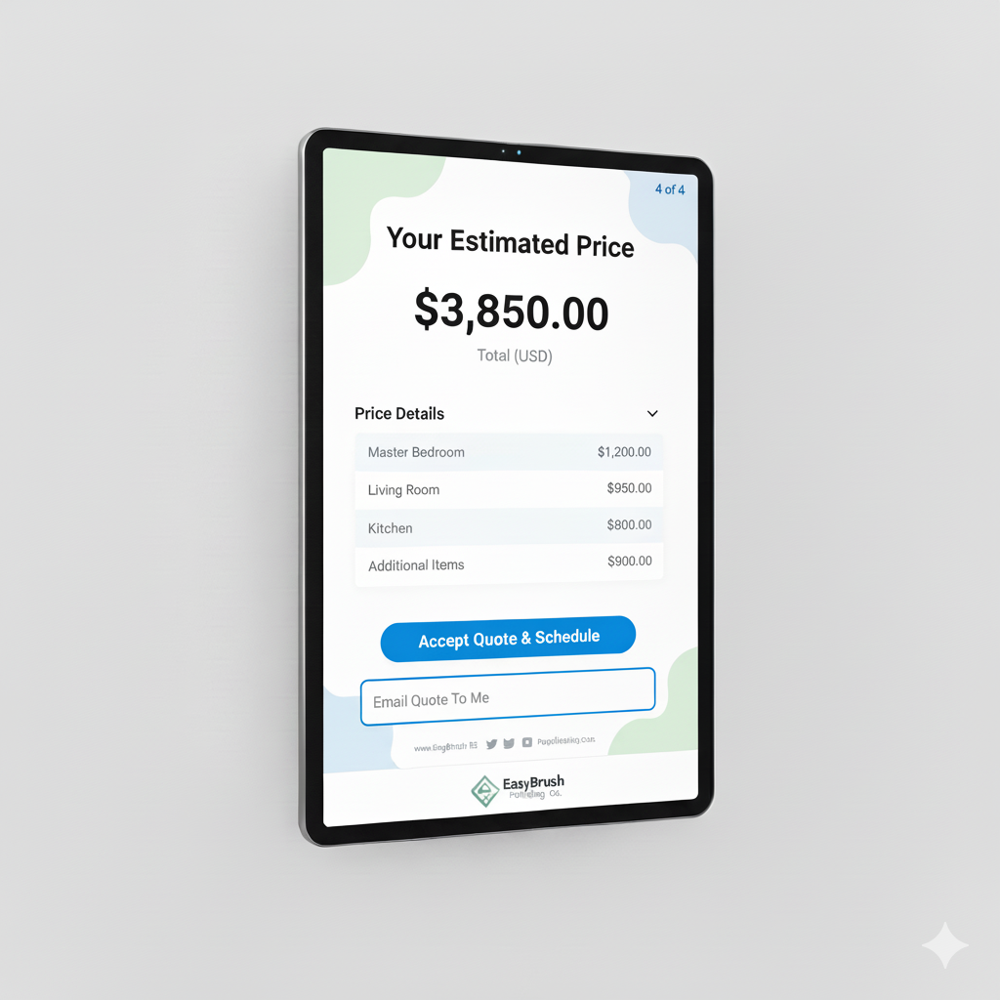

# Painting Kiosk Design Document

## 1. Goal

The primary goal of the customer-facing painting kiosk is to empower customers to independently price an interior house painting project in under five minutes, ensuring simplicity, ease of use, and a clear understanding of the estimated cost. The kiosk will leverage the existing Web API for pricing calculations and project management, maintaining architectural consistency with the main Blazor application.

## 2. Functionality

The kiosk will guide the customer through a streamlined process of defining their painting project, room by room, and generating an estimated price. Key functionalities include:

### 2.1 Project Initialization

*   **Welcome Screen:** A clear, inviting welcome message explaining the kiosk's purpose.
*   **Start New Project:** A prominent button to begin a new pricing estimation.
*   **Customer Identification (Optional/Future):** Initial design will focus on anonymous pricing, but future iterations could include an option to link to an existing customer or create a new one (e.g., via email input for sending the quote).

### 2.2 House Selection & Room Pre-population

To simplify the process, customers will first select a house size, which will pre-populate a set of common rooms with average dimensions.

*   **House Size Selection:**
    *   **1 Room Apartment:** Pre-populates with a single "Studio/Living Area" (e.g., 15x20ft, 8ft ceiling).
    *   **2 Room Apartment:** Pre-populates with "Living Room" (e.g., 15x15ft, 8ft ceiling) and "Bedroom" (e.g., 12x12ft, 8ft ceiling).
    *   **3 Room House:** Pre-populates with "Living Room," "Kitchen," "Bedroom" (common sizes, 8ft ceiling).
    *   **4 Room House:** Pre-populates with "Living Room," "Kitchen," "Master Bedroom," "Second Bedroom" (common sizes, 8.5ft ceiling).
    *   **5+ Room House:** Pre-populates with "Living Room," "Kitchen," "Dining Room," "Master Bedroom," "Second Bedroom" (common sizes, 9ft ceiling).
*   **Room Selection for Painting:** After selecting a house size, a list of the pre-populated rooms will be displayed. The customer will use checkboxes to select *which* of these rooms they wish to have painted. All selected rooms will default to having walls and ceilings painted.
*   **Average Ceiling Height:** Each house size option will come with a predefined average ceiling height.
*   **Square Footage Display:** For transparency, the estimated total square footage for painting (based on the pre-populated rooms and selected rooms) could be displayed at this stage.

### 2.3 Room Customization

The customer can then customize the selected rooms or add additional details.

*   **Edit Room:** For each selected room, the customer can:
    *   **Adjust Dimensions:** Modify pre-filled length, width, height if different from average.
    *   **Select Paintable Items:** Add or remove items like baseboards, windows (quantity), doors (quantity), crown molding, shelves/cabinets.
*   **Add Custom Room:** An option to add a room not included in the pre-populated list, requiring manual dimension input.
*   **Paint Color/Finish Selection (Basic):** Initially, the focus will be on basic pricing. A future enhancement could involve selecting general color categories or paint finishes (e.g., "Matte," "Semi-Gloss") if these significantly impact pricing. For the MVP, this might be omitted or handled as a standard default.

### 2.4 Project Summary & Pricing

*   **Room List:** A summary view of all rooms selected and customized, allowing for further editing or removal of individual rooms.
*   **Review Project:** A screen to review all entered details before requesting a price.
*   **Get Price:** A button that triggers the backend pricing calculation via the Web API.
*   **Display Price:** Once the backend has calculated the total, the estimated project price will be displayed prominently. This will include the total price and potentially a breakdown per room (optional, for transparency).
*   **Call to Action:** Options to "Print Quote," "Email Quote," or "Contact Us" to schedule a detailed consultation.

## 3. Architecture

The kiosk will be a client application (e.g., a dedicated Blazor WebAssembly app, a PWA, or a native app using web technologies) consuming the existing backend Web API.

*   **Client (Kiosk UI):**
    *   Developed using a framework suitable for touch-screen interfaces (e.g., Blazor WebAssembly for C# compatibility, or a modern JavaScript framework).
    *   Responsible for rendering the UI, capturing user input, and making API requests.
*   **Web API (Existing):**
    *   The current Web API will be used for core pricing logic, project creation, and room management.
    *   **New Endpoints (if necessary):**
        *   `POST /api/kiosk/project/predefined`: To create a new project with pre-defined rooms and associated items based on the customer's house size selection and room choices. This endpoint would accept a simplified DTO reflecting the kiosk's input, which the API would then map to the existing `Project` and `Room` entities.
        *   `PUT /api/kiosk/room/{roomId}`: To update individual room details (dimensions, items) if the customer chooses to customize them.
        *   `GET /api/kiosk/pricing/{projectId}`: A dedicated endpoint to trigger the pricing calculation for a specific project created via the kiosk. This would leverage the existing backend pricing engine.
*   **Database (Existing):**
    *   The existing database will store all project, room, and item data created by the kiosk, ensuring consistency with the main application.

## 4. User Interface Mock-ups

The UI will be clean, intuitive, and designed for touch interaction with large, clear buttons and input fields.

### 4.1 Welcome Screen / House Size Selection

This screen welcomes the customer and prompts them to start a new project by selecting their home size.

### 4.2 Select Rooms for Painting

Customers choose which pre-populated rooms from their selected house size they want painted. An estimated paintable area is displayed for context.

### 4.3 Customize Selected Rooms (Optional)

If the customer chooses to customize, they can adjust the dimensions and features of each selected room. This screen would be a loop for each room chosen for customization. It allows for detailed input for dimensions and toggles for paintable features.

### 4.4 Pricing Total Screen

This final screen displays the estimated total price, with an optional breakdown of costs per room and additional items. It provides clear calls to action for the customer to accept the quote and schedule service, or to have the quote emailed to them.
